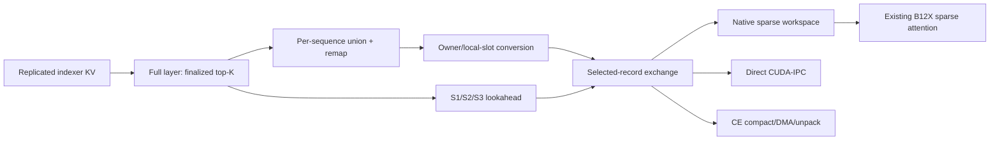

# GLM-5.2 Sparse CKV under Decode Context Parallelism

## Status

This document describes an experimental, feature-gated implementation for
GLM-5.2 sparse MLA on PCIe-connected Blackwell GPUs. It combines mixed
replicated/sharded KV allocation, full-CKV prefill lookahead, and selected-record
CKV exchange during decode.

The complete stack is validated on one 4-GPU host with TP4/DCP4/MTP3 and the
native 432-byte `nvfp4_ds_mla` + BF16-RoPE cache. Generic transport supports
other widths and DCP sizes, but those are not end-to-end model claims.
All features default off; unsupported batches retain stock DCP.

## Goals and Non-goals

Goals:

1. Preserve DCP KV capacity while recovering prefill and decode overhead.
2. Keep model math unchanged; move storage, communication, and scheduling.
3. Deduplicate MTP candidates per sequence.
4. Support bounded C1-C8 decode with explicit stock-DCP fallbacks.
5. Keep CUDA graph replay allocation-free and isolate target/draft state.
6. Separate vLLM policy from record-format-agnostic Sparkinfer transport.

Non-goals:

- Change checkpoint quantization or resident KV representation.
- Claim validated FP8-RoPE, TP6/TP8, or DCP6/DCP8 model support.
- Replace stock DCP for unsupported or overflowing batches.
- Provide host/network fallback inside CUDA-IPC transports.

## Problem and Model Structure

The stock sparse-MLA path exposes query/head communication, indexer work, KV
writes, and CKV retrieval on a mostly serial critical path. CKV traffic grows
with context, while a DCP-sharded indexer adds another distributed lookup.

GLM-5.2 starts with three Full layers and then repeats
`Full -> Shared -> Shared -> Shared`. A Full layer computes top-K; the next
three Shared layers reuse it. This permits layer-specific CKV preparation ahead
of use.

The design combines:

1. Replicated indexer KV with DCP-sharded main CKV.
2. Full native CKV gather and depth-N prefetch for prefill.
3. Selected-record exchange deduplicated across each sequence's MTP rows.

## Architecture

vLLM owns model structure, union/dedup, remapping, eligibility, fallback, and
attention metadata. Sparkinfer receives fixed-width records plus a finalized
destination map; it does not interpret CKV or compute top-K.

## Cache ABI

Validated: `nvfp4_ds_mla`, `KV_FP8_ROPE=0`.

| Region | Bytes | Meaning |
| --- | ---: | --- |
| Latent payload | 256 | Packed NVFP4 latent |
| Latent scales | 32 | Group scales |
| Alignment | 16 | Resident-cache padding |
| RoPE payload | 128 | BF16 RoPE |

The sparse workspace preserves this native 432-byte geometry so existing B12X
attention consumes it unchanged. Sparkinfer is byte-record generic; vLLM
currently gates sparse decode to this ABI.

## Mixed KV Allocation and Replicated Indexer

Replicated indexer KV and DCP-sharded main CKV need different page geometry and
block counts. Padding the indexer page is invalid because its backend requires
identity stride.

The allocator groups them separately but allocates in lockstep. Both groups
cover the same global token span per logical block, use identical block IDs,
and advance together through scheduling, prefix promotion, block tables, and
GPU tensors. External KV loads are rejected in lockstep mode because external
ownership cannot guarantee matching cross-group IDs.

`VLLM_DCP_REPLICATE_INDEXER_CACHE=1` applies only to real target indexer
layers. It requires the V2 runner, B12X sparse indexer, DCP2-8, and PCP1.
Effective indexer DCP becomes one, removing indexer-K sharding and its DCP
merge. Main CKV remains sharded; draft/MTP cache policy remains separate.

## Full-CKV Prefill

`VLLM_B12X_MLA_CKV_GATHER=1`:

1. Packs rank-local native paged CKV.
2. Gathers it on a dedicated CKV communicator.
3. Runs local query heads over global CKV.
4. Avoids normal DCP query gather and LSE merge.

It requires pure prefill, complete DCP metadata, non-DBO workspace, aligned
heads, a token count inside configured bounds, and no active CUDA capture.
Ineligible steps use stock DCP.

`VLLM_B12X_MLA_CKV_PREFETCH_DEPTH=N` allocates a `depth + 1` ring and queues
future layers on a side stream. At the target layer, current-chunk KV written
after prefetch began is patched into gathered history before attention.
Lookahead supports `fp8_ds_mla` and `nvfp4_ds_mla`; unsupported formats use
synchronous full gather.

## Sparse Selected-Record Decode

`VLLM_B12X_MLA_SPARSE_DECODE_CKV_GATHER=1`:

1. Finalizes top-K for every query row.
2. Groups rows by request.
3. Builds a stable dense union per destination/request across MTP rows.
4. Produces exact row-to-union remaps.
5. Converts logical tokens to owner-local paged-cache slots.
6. Exchanges only owned native records.
7. Patches the current token when lookahead preceded its KV write.
8. Runs existing local-head B12X attention over the sparse workspace.

MTP3 has up to four rows/request and a worst-case `4 * topk` union. Dedup makes
wire traffic follow unique records per sequence instead of speculative depth.
Dedup never crosses unrelated requests.

The workspace is pooled. `POOL_RECORDS=0` covers the configured fast-path
request count. A smaller pool saves VRAM and lowers the fast-path concurrency
bound. Overflow and unsupported shapes use stock DCP.

## Shared-Layer Bulk Lookahead

After a Full layer, depth three discovers S1/S2/S3. They share indices and
remap geometry but retain distinct CKV values.

With CE and `VLLM_B12X_MLA_SPARSE_DECODE_BULK_PREFETCH=1`, exactly three
compatible layers use one pack, transfer, and synchronization sequence. S1 may
wait for the combined packet; S2/S3 consume ready workspaces without new
inter-rank barriers. Missing API support, incompatible layers, or layered
capacity overflow falls back to per-layer exchange.

The pooled sparse path supports C1-C8. The bulk CE speedup was measured only
within its layered capacity; larger batches retain the per-layer path.

## Transport Backends

### Direct CUDA-IPC

An SM kernel scans each destination map and peer-writes owned records into a
destination CUDA-IPC slab at final selected positions. Barrier phase 0 makes
writes visible; the destination copies its slab into caller output; phase 1
prevents reuse. This avoids NCCL gather/recombine but retains one local D2D copy.

### Copy Engine

CE compacts owned records per destination, preserves final positions, rotates
destination order by rank, and transfers a contiguous primary packet with
`cudaMemcpyAsync`. Owner skew uses an IPC overflow region. One arrival barrier
precedes unpack; release is deferred until slab reuse. CE costs staging VRAM but
uses fewer SM resources and implements the three-layer bulk API.

### Shared Contract

Both require contiguous CUDA records/output, a contiguous integer destination
map, exactly one owner per destination slot, rank-identical call order and
active count, CUDA IPC/P2P, one stream-affine channel per stream, eager binding
before capture, and cleanup before process-group destruction.

NCCL is used for initialization and rank-consistency handshakes. Record data
moves through CUDA IPC peer stores or peer DMA. No host/network fallback exists
inside the transport.

`transport=auto` prefers CE and falls back to direct if CE initialization is
unavailable. `ce` is strict. `direct` never constructs CE state.

## CUDA Graph and Correctness

Sparse state is keyed by workspace identity and execution-lane key, preventing
target and draft passes from aliasing rings, events, workspaces, or channels.
Graph capacity must cover `max_fast_requests * rows_per_request`.

Initialization rank-consistently preloads the dense-union extension and binds
transport channels. Replay changes data/maps without allocations or address
changes. Full-CKV prefill is disabled during capture; selected-record decode is
graph-safe after eager setup.

Correctness invariants:

1. Exactly one source owns every destination position.
2. Stable union/remap is rank-identical.
3. MTP dedup is per request.
4. Replicated-indexer and sharded-CKV blocks advance in lockstep.
5. Current-layer writes patch prefetched history before use.
6. S1/S2/S3 share indices, not values.
7. Every rank issues communication in identical order.
8. Target/draft and caller-stream state cannot alias.
9. Graph replay allocates nothing.
10. Unsupported shapes use stock DCP.

## Configuration

All features default off.

| Variable | Default | Purpose |
| --- | --- | --- |
| `VLLM_DCP_REPLICATE_INDEXER_CACHE` | `0` | Replicate target indexer KV |
| `VLLM_DCP_GLOBAL_TOPK` | `1` | Preserve global top-K semantics |
| `VLLM_DCP_QUERY_SPLIT` | `0` | Remove duplicate query work where applicable |
| `VLLM_B12X_MLA_CKV_GATHER` | `0` | Enable full-CKV prefill |
| `...CKV_GATHER_MIN_TOKENS` | `16` | Minimum prefill size |
| `...CKV_GATHER_MAX_TOKENS` | `524288` | Workspace ceiling |
| `VLLM_B12X_MLA_CKV_PREFETCH_DEPTH` | `1` | Lookahead; 0 is synchronous |
| `...SPARSE_DECODE_CKV_GATHER` | `0` | Enable selected-record decode |
| `...SPARSE_DECODE_TRANSPORT` | `direct` | `auto`, `ce`, or `direct` |
| `...SPARSE_DECODE_BULK_PREFETCH` | `0` | One CE exchange for S1/S2/S3 |
| `...SPARSE_DECODE_MAX_SEQS` | `8` | Fast-path request ceiling |
| `...SPARSE_DECODE_POOL_RECORDS` | `0` | Pool records; 0 is automatic |

Query splitting is independent and gives no duplicate-work reduction at
TP4/DCP4 because TP/DCP is one.

## Eligibility and Fallback

| Condition | Full-CKV prefill | Sparse decode |
| --- | --- | --- |
| DCP | >1 | 2-8 |
| Workspace | non-DBO | non-DBO |
| Heads | aligned | aligned |
| Cache | gather generic; lookahead gated | 432-byte NVFP4 + BF16 RoPE |
| Shape | pure prefill | bounded uniform decode rows |
| Capture | stock fallback | allowed after eager setup |
| Missing metadata | stock fallback | stock fallback |
| Request/pool overflow | N/A | stock fallback |
| CE layered overflow | synchronous/per-layer | per-layer |

## Validated Profile and Results

Hardware: ASUS WRX90E-SAGE SE, Threadripper PRO 9965WX, 128 GiB RAM,
4x RTX PRO 6000 Blackwell 96 GB at 400 W, full peer access, ACS/IOMMU off.

| Setting | Value |
| --- | --- |
| Parallelism | TP4 / DCP4 / MTP3 |
| Model limit | 300,000 |
| Max sequences / batch / graph | 8 / 2,048 / 32 |
| GPU utilization | 0.98 |
| KV allocation | 3,426,112,942 bytes/GPU |
| Reported KV | 302,047 tokens |
| Cache | `nvfp4_ds_mla`, BF16 RoPE |
| Features | replicated indexer, depth-3 full CKV, CE sparse, bulk S1/S2/S3 |
| TP all-reduce | NCCL |

Daily five-run temperature-zero coding: 105.2 tok/s median, 104.5 mean,
101.6-108.0 range.

| Cold prefill | 8K | 32K | 64K | 128K | 256K |
| --- | ---: | ---: | ---: | ---: | ---: |
| tok/s | 3,326 | 3,139 | 2,966 | 2,719 | 2,356 |

Matched 90K coding: DCP4/MTP3 CE sparse improved 82.9 -> 99.2 tok/s (+19.6%)
at unchanged 302,080-token KV. At MTP0: 44.4 -> 45.4 (+2.4%). Bulk S1/S2/S3
improved the 64K+ prefill geometric mean by 8.5% and coding
99.63 -> 103.79 with unchanged KV.

Deterministic output matched byte-for-byte twice at about 8K, 64K, and 128K.
Results are configuration-sensitive and are not TP8/DCP8 projections.

## Verification

- 160 vLLM policy/workspace tests passed; 18 skipped.
- 3 mixed-DCP allocator tests passed.
- 57 Sparkinfer transport tests passed; 4 GPU-only tests skipped in CI.
- Ruff, formatting, mypy 3.10-3.13, Clang-format, import/API checks passed.
- Four-GPU startup, target/MTP graph capture, API/transport smoke, long-prefill
  correctness, and C2/C4 decode gates passed.
- Transport GPU tests cover eager/graph replay, changing maps, empty/full
  capacity, odd/production widths, rank-consistent failure, overflow, layered
  exchange, DCP4, and offsets above 2 GiB.

## Failure Behavior and Observability

Startup logs report active gather, prefetch, sparse decode, transport, and bulk
exchange. Eligibility logs report format/topology/request fallback. Transport
initialization validates rank agreement, extension load, allocation, IPC
handles, and peer access. Barriers time out and device-trap instead of spinning
forever. Strict CE surfaces failure; automatic mode may choose direct.

JIT compilation can contaminate latency. Warm every measured shape or enable
compile-progress diagnostics before recording results.

## Remaining Work

Required validation:

- TP6/TP8 and DCP6/DCP8 full-model correctness and scaling.
- Matched final-image DCP1/DCP4/DCP8 comparisons.
- C1-C8, 8K-256K, MTP0/MTP3 stress and prolonged agent/tool-call tests.
- CE/direct comparison on switched and non-switched fabrics.
- Missing-P2P, pool-overflow, graph, and allocation-failure fallbacks.
- FP8-RoPE, FP8/NF3 KV, calibrated outer scales, and >128K exact output.
- Rebuild/GPU-test exact clean vLLM head; packaged validation used the
  runtime-equivalent pre-cleanup head.

Candidate optimizations:

- Peer-write directly into final attention storage, removing local copy/unpack.
- Finish indexer/Q/KV stream overlap.
- Generalize vLLM record geometry beyond 432 bytes.
- Evaluate sparse Full-layer transfer against query gather + LSE merge.
- Skip the 16-byte alignment field on wire after padding-poison validation.
- Tune split-K and launch geometry by topology.

## Upstream Decomposition

1. Sparkinfer direct fixed-record CUDA-IPC exchange.
2. Sparkinfer CE exchange and three-layer API.
3. vLLM mixed MLA lockstep allocation.
4. vLLM target indexer replication.
5. vLLM native full-CKV depth-N prefetch.
6. vLLM selected-record policy, union/remap, and fallback.
7. vLLM CE three-layer integration.
8. Keep deployment recipes and host tuning outside runtime PRs.

Each PR should remain feature-gated, focused, tested, and linked to this
document. Transport PRs stay record-format agnostic; the 432-byte restriction
belongs in vLLM until more formats are validated.

## Credits

The design originates from Koush's CKV-gather, shared-layer lookahead, sparse
decode, and per-sequence MTP-deduplication work. It builds on Luke Alonso's B12X
and Sparkinfer infrastructure and local-inference-lab's GLM-5.2 integration.

Implementation, testing, benchmarking, and documentation were developed with
OpenAI Codex assistance and manually reviewed and validated on the target host.
